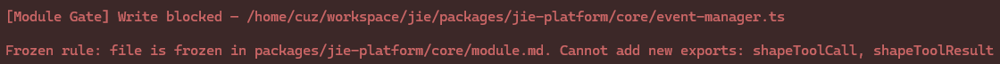

# pi-module-gates - Constraints liberate, liberties constrain.

Experimental pi cli extension that controls the entropy of the codebase by enforcing code module boundaries.
It helps combat slop generation and code architecture degradation.
- Claude Code supported via a hook, see below.

## Problem

AI coding agents produce edits with limited context knowledge (myopia) — their changes may leak implementation details, and break architectural contracts (slop).

### Approach

**Module contracts as guardrails.** Each directory can contain a descriptor file that declares:

- `readonly` — files and directories the agent must not touch
- `sealed` — files where no new exports are allowed (body still editable)
- `visible` — the set of exports allowed to be added or modified in that module
- `signature-lock` — names whose captured signature must remain unchanged (body still editable)

The extension intercepts agent `write`/`edit` operations and enforces these contracts. Violations are blocked with a clear reason.

The attempt to add 2 public helper functions is blocked, forcing the agent to re-think the design.


### How it works

1. **Indexing** — On session start, scans the project tree for descriptor files and builds a module index.
2. **System prompt** — Injects a hint so the agent knows to respect descriptor file conventions.
3. **Gating** — On every write/edit, checks:
   - **Readonly gate** — is the target file locked?
     **Sealed gate** — would the change add new exports to a file in the `sealed` list?
   - **Signature gate** — would the change alter a locked signature declared in the module's `signature-lock` list?
   - **Export gate** — would the change introduce an export not in the `visible` list?
   - **Module interface import gate** — external files can only import from the module not internal files, i.e. re-exports from `index.ts` or `mod.rs`. A child module may import from a parent module's internal files (not recommended but allowed). (Only Typescript/JavaScript and Rust are supported)
   - **Import gate** (not implemented yet) — would the change introduce an import violating visibility scope?

- System prompt: [system-prompt.md](src/context/system-prompt.template.md)
- Currently [supported languages](src/gates/export-checkers/index.ts): **TypeScript/JavaScript**, **Rust**, **Java**, **Go**, **Kotlin**, **Scala**
- Signature checkers ([src/gates/signature-checkers/index.ts](src/gates/signature-checkers/index.ts)) ship a TypeScript/JavaScript checker; other languages are stubs in v1.

## Installation
```bash
pi install npm:@cuzfrog/pi-module-gates
```
Or load directly for a single session:
```bash
pi -e npm:@cuzfrog/pi-module-gates
```

## Module Descriptor Semantics

A module descriptor is a Markdown file (default name: `MODULE.md`) placed in a directory. You can piggy-back on your module context file for example `CONTEXT.md`.

### Readonly constraints

```markdown
---
readonly: [mod.rs]
---

Any prose for the agent to better understand the module.
```

### Sealed constraints

```yaml
sealed: [mod.rs]
```
Sealed files cannot change their surface size: no new exports or public entries are allowed. The file body is still editable.

A skill [module-seal-all](skills/module-seal-all) has been included to auto-seal modules.

### Type Signature Lock (signature-gate)

```yaml
signature-lock:
  - my-type.ts$MyFunction
  - sub/foo.ts$Bar
```

Lock the captured signature of named types in a target file. The `$` separates the file path (resolved relative to the module directory) from the symbol name. The body of the declaration remains editable; only the captured head (parameter list, return type, generics, class `extends`/`implements`, interface body, or type alias RHS) must remain unchanged.

For a file `src/my-type.ts` containing `export function MyFunction(a: number): boolean { ... }`:
- Adding a parameter breaks the lock.
- Changing the return type breaks the lock.
- Changing only the body (`return true;` → `return false;`) is allowed.

Limitations (v1):
- Signatures are extracted via regex (not AST); multi-line parameter lists with comments inside parens may produce false positives.
- Interfaces are locked in their entirety (the body is part of the signature).
- Class inner methods are not individually lockable; only the class header is captured.
- Only TypeScript/JavaScript ships a complete checker; Rust/Java/Go/Kotlin/Scala stubs return empty maps so signature-lock entries for those languages are silently ignored.

### Visibility whitelist (under redesign)

```yaml
visible:
  - greet # equivalent to `path: ./greet`
  - sub/mod1/Foo
```
or:
```yaml
visible:
  - path: my_function
    modifier: pub(crate) # (optional) demands an exact match
```

| Scenario | Behavior |
|----------|----------|
| `visible` key absent or no `MODULE.md` | Module is unconstrained — exports are not gated. Equivalent to `null` internally. |
| `visible: []` | Module is fully closed — no new exports may be added. Editing existing exports is still allowed. |
| Malformed YAML frontmatter | The module is left unguarded and an info notification is emitted. |

### Export gating

```
project/
  MODULE.md          visible: [Foo, Bar]
  src/
    MODULE.md        visible: [Bar, Baz]
    app.ts           ← checked against `src/MODULE.md` only
```
A `MODULE.md` only enforces exports within its immediate directory.

### Import gating (not implemented yet)

```yaml
# parent/MODULE.md
visible:
  - sub/Tool # type Tool is allowed to be imported from parent

# parent/sub/MODULE.md (before complement pass)
visible:
  - Bar # type Bar is allowed to be imported from parent/sub within parent, but not outside parent
```
A `MODULE.md` semantically gates exposures at the module level it resides.

## Configuration

Add a `module-gates` entry to `.pi/settings.json`:

```json
{
  "module-gates": {
    "moduleDescriptorFileName": "MODULE.md",
    "moduleDescriptorReadonly": "file",
    "sourceRoot": "src/"
  }
}
```

| Option | Default | Description |
|--------|---------|-------------|
| `moduleDescriptorFileName` | `MODULE.md` | File name used for module descriptors (case-insensitive) |
| `moduleDescriptorReadonly` | `"frontmatter"` | `"file"` makes the whole descriptor readonly; `"frontmatter"` locks only the YAML frontmatter (body prose stays editable); `"off"` disables descriptor readonly. `true`/`false` are also accepted for backward compatibility. |
| `sourceRoot` | `"src/"` | Directory to scan for descriptor files and enforce gates. Set to `""` to scan from project root. |
| `disableModuleInterfaceImportGate` | `false` | When `true`, imports will not be forced to be from module interface. |
| `disableSystemPrompt` | `false` | When `true`, skip injecting the module-gates hint into the agent's system prompt. |

When no settings file exists or no `module-gates` key is present, defaults apply.

## Claude Code Support

### Install
Add the following to `.claude/settings.json` in the current project, pointing the `PreToolUse` hook at the installed binary.
```json
{
  "hooks": {
    "PreToolUse": [
      {
        "matcher": "Edit|MultiEdit|Write",
        "hooks": [
          {
            "type": "command",
            "command": "bun ${CLAUDE_PROJECT_DIR}/node_modules/@cuzfrog/pi-module-gates/src/claude/pre-tool-use.ts",
            "statusMessage": "Module gate checking edit..."
          }
        ]
      }
    ]
  }
}
```

If `pi-module-gates` is already installed in pi global dir, you can use below path instead:
```
~/.pi/agent/npm/node_modules/@cuzfrog/pi-module-gates/src/claude/pre-tool-use.ts
```

### System prompt
You need to add [system-prompt.md](src/context/system-prompt.template.md) manually to your context.

### Configuration

Claude Code uses the same `.pi/settings.json#module-gates` block as the pi extension. See the Configuration section above.

### Troubleshooting
Prompt:
```
Check if PreToolUse hook `pi-module-gates` is triggered and runs expectedly.
```

## License

MIT

## Author
Cause Chung (cuzfrog@gmail.com)
